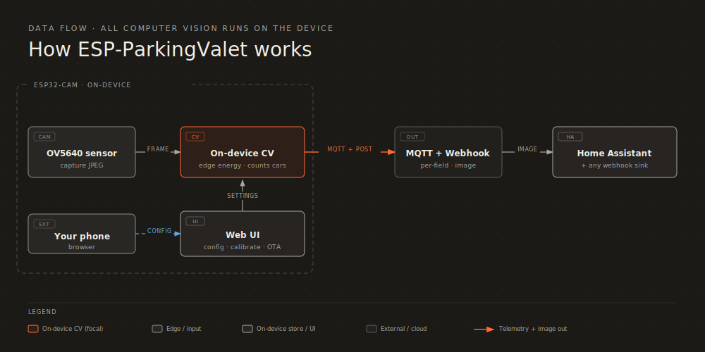
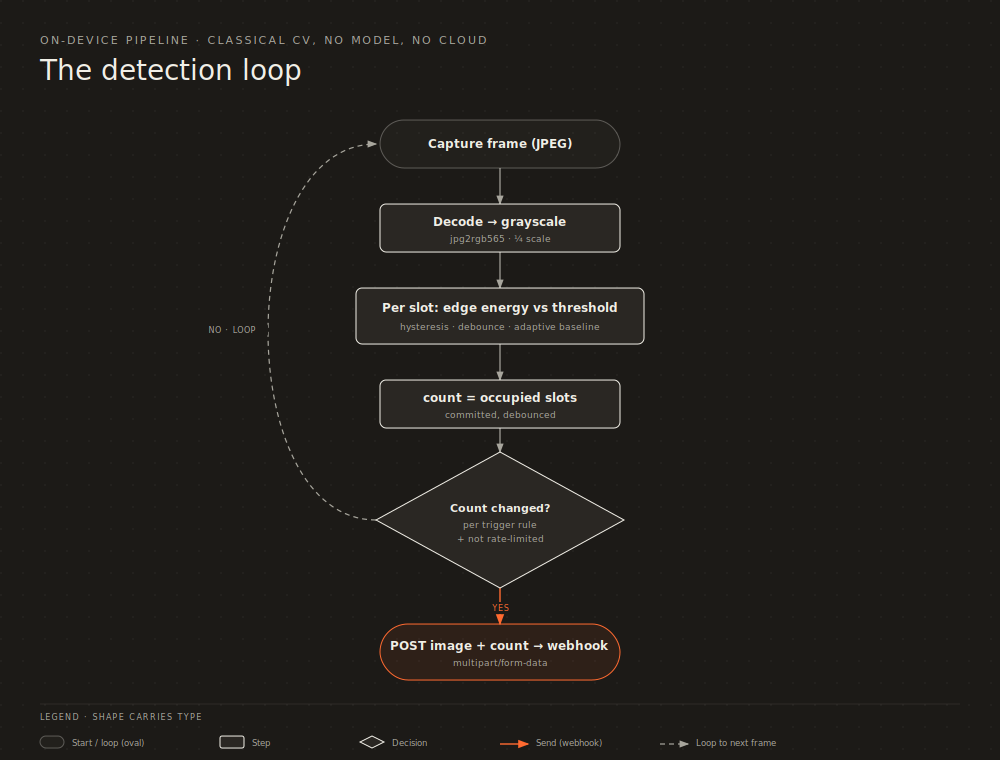
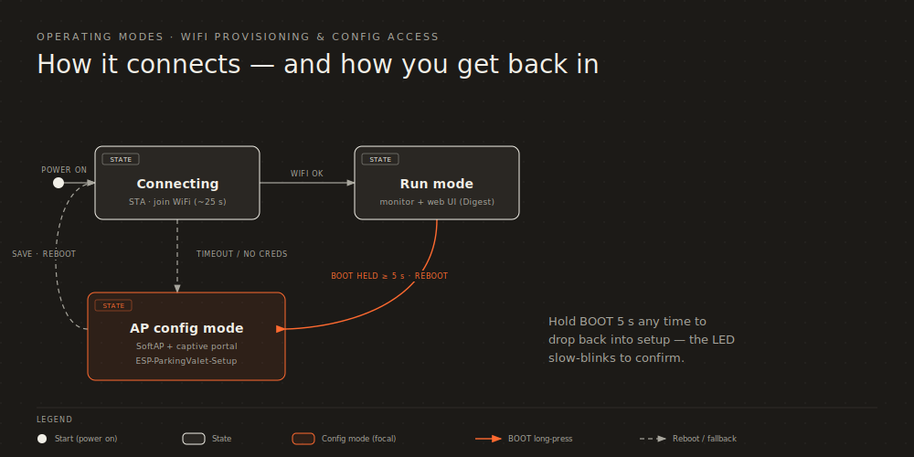

# ESP-ParkingValet

An ESP32-CAM that watches a few marked parking bays and counts the cars. All of the computer
vision runs on the board, so no picture is ever sent off-device just to count. When the number of
occupied bays changes it POSTs the photo to a webhook, and it keeps Home Assistant up to date over
MQTT.

You configure everything from the web UI, so changing a threshold never means reflashing. On boot
it joins your WiFi; if it can't, it brings up its own setup hotspot. Holding the BOOT button for
five seconds forces that hotspot back whenever you need it.

<p align="center"></p>

> **Hardware:** a plain-ESP32 ESP32-CAM with the OV5640 V1.2 module (ESP32-D0WDQ6, 8 MB PSRAM,
> CH340X USB, IP5306). The pin map is the one from
> [giovi321/ESP32-cam-OV5640](https://github.com/giovi321/ESP32-cam-OV5640), cross-checked against
> the board's own IO table. This firmware replaces ESPHome on the board.
>
> **Repo:** https://github.com/giovi321/ESP-ParkingValet

---

## What it does

- Counts cars on the board with classical CV. Each bay is a polygon, and occupancy comes from the
  edge energy inside it, with hysteresis and a debounce so the number doesn't flicker. There's no
  model and nothing to train.
- POSTs the JPEG to a webhook when the count changes (or when it crosses a threshold you set).
  Optional auth header, http or https.
- Sends a second telemetry webhook on a timer (IP, RSSI, heap, count, version, and so on).
- Publishes to MQTT with Home Assistant auto-discovery: one HA device, each value on its own
  topic, the firmware version and a GitHub link in the device info, and an availability (LWT)
  topic. TLS works too.
- Web UI with a live snapshot, a drag-to-edit polygon editor, live per-bay edge values, an
  on-device serial console, and config backup/restore. Every setting is editable at runtime and
  saved to NVS.
- Drives the OV5640 autofocus (focus once, continuous, or off) with a *Focus now* button.
- Looks after itself: auto-reconnect, a WPA2 setup hotspot when it can't join, an offline-reboot
  watchdog, and a status LED.
- OTA updates, factory reset, and a git SHA stamped into every build so you always know what's
  running.

---

## How the counting works

It grabs a frame about once a second and looks at each bay you've drawn. A parked car adds a lot
of edges and texture next to plain asphalt, and edges hold up far better than brightness when the
sun moves around, so the signal is the edge energy inside each polygon. The test is point-in-
polygon, so a bay can be any shape, not just a rectangle. Separate enter and exit thresholds, a
few-frame debounce, and a slowly-adapting "empty" baseline keep the number steady through shadows,
clouds, and someone wandering across the lot.

<p align="center"></p>

`count` is how many enabled bays are occupied, worked out on the board ([`src/cv.cpp`](src/cv.cpp)).
The webhook and MQTT consumers just receive it.

> **Daylight only.** A bare OV5640 sees almost nothing in the dark; for night you'd add IR light
> and re-tune. The lens is an autofocus module rated for roughly 20-250 cm, so cars further away
> look a bit soft. That's fine for counting, not for reading plates.

---

## First run and WiFi

<p align="center"></p>

On boot it tries your WiFi for about 25 seconds. With no saved network, or if the join fails, it
starts a WPA2 hotspot with a captive portal. You can also force that at any time by holding BOOT
for five seconds; the LED slow-blinks to confirm.

Setting it up the first time:

1. Flash and power the board. It comes up as the hotspot **`ESP-ParkingValet-Setup`**
   (password **`parking1234`**) with the LED slow-blinking.
2. Join it from a phone. The captive portal opens the UI, or browse to `http://192.168.4.1/`.
3. Open **WiFi**, enter your network, and save. It reboots and connects.
4. Once it's on your network (LED heartbeat), find its IP from the serial log or your router and
   open `http://<device-ip>/`.

On your network the UI asks for a login (HTTP Digest, default `admin` / `parking`, and it nags
until you change it in *System*). In setup mode the UI is open, since the hotspot password is
already the gate.

---

## Hardware

### Pin map ([`src/camera_pins.h`](src/camera_pins.h))

| Camera signal | GPIO | | Camera signal | GPIO |
|---|---|---|---|---|
| XCLK (MCLK) | 15 (12 MHz) | | D2 / Y2 | 2 |
| PCLK | 26 | | D3 / Y3 | 14 |
| VSYNC | 18 | | D4 / Y4 | 35 |
| HREF (HS) | 36 | | D5 / Y5 | 12 |
| SIOD / SDA | 22 | | D6 / Y6 | 27 |
| SIOC / SCL | 23 | | D7 / Y7 | 33 |
| RESET | 5 | | D8 / Y8 | 34 |
| PWDN | not wired | | D9 / Y9 | 39 |

### Buttons and LED

| Control | GPIO | Use |
|---|---|---|
| IO0 / BOOT | 0 | Free (the camera doesn't use it). Hold 5 s to drop into AP config mode. |
| RST | EN | Hardware reset. On battery (IP5306), double-click powers down and a single click powers up. |
| Status LED | 25 | Slow blink in AP/config, fast blink while connecting, brief heartbeat once it's running. |

If the LED reads inverted on your board, flip `LED_ACTIVE_LOW` in
[`src/camera_pins.h`](src/camera_pins.h). There's also a `-DPARKINGCAM_BUTTON_DISCOVERY` build
flag that logs GPIO transitions if you ever need to find another button.

### 3D-printed case

A printable enclosure for the board is in
[`hardware/ESPCam_OV5640_case_v5.stl`](hardware/ESPCam_OV5640_case_v5.stl) (modeled in SketchUp).
The geometry is nothing unusual, so slice it with whatever settings your printer already likes.

To put it together you'll need:

- One **1/4" threaded insert**, set about 6 mm into its hole. That's the standard 1/4"-20 camera
  thread, so the finished case screws onto a tripod or any camera mount.
- Four **2 mm × 9 mm self-tapping screws**.
- Four **2 mm × 5 mm self-tapping screws**.

Press or heat-set the insert until it bottoms out in the 6 mm hole, then run the self-tappers
straight into the printed bosses. Ease off on the last turn so you don't strip the plastic.

---

## Build and flash (PlatformIO)

```bash
pio run                 # build (first run downloads the ESP32 toolchain)
pio run -t upload       # flash over USB-C (CH340X)
pio device monitor      # 115200 baud
```

You need a board with PSRAM and at least 4 MB flash (the `min_spiffs` partition keeps two app
slots for OTA). The web UI lives in [`web-src/index.html`](web-src/index.html); a pre-build hook
([`tools/pio_prebuild.py`](tools/pio_prebuild.py)) gzips it into `src/web_ui.h` on every build, and
stamps the git SHA into `src/build_info.h`. To regenerate the UI by hand:

```bash
python tools/gen_web_ui.py
```

Every build records its git short SHA. After flashing, the serial banner
(`ESP-ParkingValet 1.0.0 (<sha>) booting`) and *System > Firmware* (`1.0.0 · <sha>`) show it, so
you can check it against `git rev-parse --short HEAD`.

---

## Drawing the bays

This is the part that decides how well it works. Mount the camera so every bay is in frame, then:

1. Open **Live**, tap **+ Add slot** (you get a 4-point quad), drag the body to move it and the
   dots to match the bay. Use **+ point / - point** for angled or L-shaped bays (3 to 8 vertices).
   Name them and **Save slots**.
2. Watch each bay's **Edge** value. Empty asphalt reads low, a parked car reads much higher.
3. In **Detection**, set the global edge threshold between those two. If one bay sits in shade,
   give it its own threshold (0 means use the global one).
4. If the count twitches, raise **Stable frames** or **Hysteresis**. **Capture interval** trades
   responsiveness for CPU.
5. Leave it running from sun to cloud and confirm it doesn't flip on moving shadows.

Polygons are stored normalized (0 to 1), so they survive a resolution change.

---

## Autofocus

The module has a real (VCM) autofocus lens. Pick a mode in **Image > Autofocus**:

- **Off / fixed:** leave the lens alone.
- **Auto once** (default): focus once at boot and lock. Best for a fixed scene.
- **Continuous:** keep refocusing. Only worth it if the scene depth changes, and it can hunt and
  blur a frame mid-count.

**Focus now** triggers a single refocus, and the System tab shows the focus status. The AF
firmware (about 5 KB, from the [0015/ESP32-OV5640-AF](https://github.com/0015/ESP32-OV5640-AF)
library) loads into the sensor over SCCB the first time it's used.

> The lens only physically moves if **AF-VCC** is powered on the module. The firmware load
> succeeds either way, so if the status says *focused* but the picture stays soft, that's the pin
> to check.

---

## Configuration reference

Everything here is editable in the UI and saved to NVS. Defaults come from
[`src/config_store.cpp`](src/config_store.cpp).

| Group | Setting | Default | Notes |
|---|---|---|---|
| WiFi | `staSsid` / `staPass` | — | Your network. Saving reboots to reconnect. |
| | `apSsid` / `apPass` | `ESP-ParkingValet-Setup` / `parking1234` | Setup hotspot (WPA2, password at least 8 chars). |
| | `hostname` | `esp-parkingvalet` | mDNS/DHCP hostname. |
| | `offlineRebootMin` | `0` | Reboot if WiFi stays down this many minutes (0 is off). Keeps retrying until back online. |
| Web auth | `adminUser` / `adminPass` | `admin` / `parking` | Digest auth in STA mode. Change it on first login. |
| Webhook | `whEnabled` | `false` | Master on/off for sending. |
| | `whUrl` | — | Full URL (http or https). |
| | `whAuthHeaderName` / `whAuthHeaderValue` | — | e.g. `X-API-Key` or `Authorization: Bearer …`. |
| | `whTlsInsecure` | `true` | Skip cert check for self-signed https. |
| Stats webhook | `statsEnabled` | `false` | Periodic telemetry on/off. |
| | `statsUrl` | — | Full URL (separate from the image webhook). |
| | `statsIntervalS` | `300` | Seconds between telemetry POSTs. |
| | `statsAuthHeaderName` / `statsAuthHeaderValue` | — | Optional auth header. |
| | `statsTlsInsecure` | `true` | Skip cert check for self-signed https. |
| MQTT | `mqttEnabled` | `false` | Master on/off. |
| | `mqttHost` / `mqttPort` | — / `1883` | Broker host and port (8883 for TLS). |
| | `mqttTls` / `mqttTlsInsecure` | `false` / `true` | mqtts, and skip cert check. |
| | `mqttUser` / `mqttPass` | — | Broker credentials (optional). |
| | `mqttBaseTopic` | `parking-valet` | Per-field topics live under here. |
| | `mqttDiscovery` / `mqttDiscoveryPrefix` | `true` / `homeassistant` | HA auto-discovery. |
| | `mqttIntervalS` | `60` | Diagnostics refresh interval (count goes out immediately). |
| Trigger | `triggerMode` | `0` | 0 sends on any count change, 1 sends when it crosses threshold N. |
| | `triggerThreshold` | `1` | N, for threshold mode. |
| | `minSendIntervalMs` | `5000` | Rate-limit between sends. |
| | `heartbeatIntervalS` | `0` | 0 is off, otherwise a periodic snapshot. |
| Detection | `edgeThreshold` | `12.0` | Global occupancy threshold (mean abs gradient). |
| | `hysteresis` | `0.25` | Enter at thr·(1+h), exit at thr·(1−h). |
| | `baselineEma` | `0.02` | How fast the empty baseline adapts. |
| | `stableFrames` | `4` | Cycles a bay's state must hold before it commits. |
| | `captureIntervalMs` | `1500` | Capture/analyze cadence. |
| Image | `framesize` | `9` (SVGA 800×600) | QVGA up to UXGA; bigger is sharper but slower. |
| | `jpegQuality` | `12` | 8 (best) to 63 (smallest). Below 8 the OV5640 can produce bad frames, so it's clamped to 8. |
| | `vFlip` / `hMirror` | `false` | Orientation. |
| | `brightness` / `contrast` / `saturation` | `0` | −2 to 2. |
| | `awb` / `aec` | `true` | Auto white-balance / auto-exposure. |
| | `afMode` | `1` | Autofocus: 0 off/fixed, 1 focus once, 2 continuous. |
| ROI (per bay) | `points` | — | Polygon vertices (3 to 8), each normalized 0 to 1. |
| | `threshold` | `0` | Per-bay override (0 uses the global one). |
| | `enabled` | `true` | Disabled bays show on screen but don't count. |

---

## Webhook payload

`multipart/form-data`, built in PSRAM, sent with `HTTPClient` (`WiFiClientSecure` for https):

| Part | Type | Description |
|---|---|---|
| `image` | file (JPEG) | Filename `<host>_<count>_<uptimeS>.jpg`. |
| `device` | field | Hostname. |
| `event` | field | `count_changed`, `heartbeat`, or `test`. |
| `count` / `prev_count` | field | New and previous occupied count. |
| `slots` | field | JSON array of per-bay booleans, e.g. `[true,false,true]`. |
| `ts` / `time` | field | UTC timestamp: epoch seconds and ISO8601. Both empty until NTP syncs. |

The image webhook deliberately carries no diagnostics, just the photo, the occupancy, and the
timestamp. Diagnostics go to MQTT and the stats webhook. Your auth header, if set, goes on every
request, and the clock is NTP-synced in UTC. Any HTTP endpoint can take it; the JPEG arrives as a
multipart file field named `image`.

### Stats webhook

A separate `application/json` POST every `statsIntervalS` to `statsUrl`. Fields: `device`,
`version`, `build`, `mode`, `ip`, `rssi`, `ssid`, `mac`, `uptime_s`, `heap_free`, `psram_free`,
`reset_reason`, `roi_count`, `count`, `cv_ms`, `analysis`, `webhook_enabled`, `ts` (UTC epoch),
`time` (ISO8601). The **Send stats now** button posts it on demand.

---

## MQTT and Home Assistant

Set the broker up in the **MQTT** tab: host, port, optional TLS (mqtts), username/password, base
topic, discovery, and interval. Once it's on, the board:

- Publishes each field to its own retained topic under the base topic, like `parking-valet/count`,
  `/rssi`, `/ip`, `/ssid`, `/uptime_s`, `/heap_free`, `/psram_free`, `/roi_count`, `/mode`,
  `/version`, `/build`, `/time`. `count` goes out the moment it changes; the rest refresh on the
  interval.
- With auto-discovery on, publishes retained configs under
  `homeassistant/sensor/parkingvalet/<field>/config`. Home Assistant then builds one device
  (*ESP-ParkingValet*) that carries the firmware version (`sw_version`) and a GitHub link
  (`configuration_url`). Device classes and units are filled in (signal_strength, duration,
  data_size, timestamp, and so on), and the diagnostics are tagged as such.
- Sets an availability (LWT) topic, `parking-valet/availability` (`online`/`offline`), so HA marks
  the device unavailable if it drops off the network.

It carries the same information as the two webhooks. The photo itself stays on the image webhook.
**Publish now** in the MQTT tab pushes immediately, and the System tab shows the connection state.

---

## Backup and restore

In **System > Backup & restore**, *Download backup* saves the whole config as JSON (it includes
secrets, so keep the file somewhere safe) and *Restore* uploads one and reboots to apply it. The
same thing is available at `GET /api/backup` and `POST /api/restore`.

---

## HTTP API

In STA mode every route needs Digest auth. In AP/setup mode they're open.

| Method | Path | Purpose |
|---|---|---|
| `GET` | `/` | The web UI (gzipped). |
| `GET` | `/api/state` | Live status: mode, IP, RSSI, count, per-bay values, heap, AF and MQTT status, last send. |
| `GET` | `/api/config` | Current config (secrets masked). |
| `POST` | `/api/config` | Merge a partial config (blank secrets are left alone). |
| `GET` | `/snapshot` | Current camera JPEG. |
| `GET` | `/api/log` | The on-device log ring buffer (this is what the web serial console reads). |
| `GET` | `/api/backup` | Download the full config as JSON (includes secrets). |
| `POST` | `/api/restore` | Restore a backup, then reboot. |
| `POST` | `/api/action` | `{"action":"reboot\|factory_reset\|ap_mode\|test_webhook\|test_stats\|test_mqtt\|af_focus"}`. |
| `POST` | `/update` | OTA firmware upload (`.bin`). |

---

## Security

The STA web UI uses HTTP Digest auth, so the password never crosses the wire in clear and there's
no need for TLS on a trusted LAN. Put a reverse proxy in front if you want transport encryption.
Setup mode is gated by the WPA2 hotspot password. Webhook and MQTT egress can both use TLS and
carry your credentials. Config (including secrets) lives in NVS on internal flash; turn on flash
encryption if at-rest protection matters. The config API never returns secrets.

---

## Troubleshooting

| Symptom | Check |
|---|---|
| `camera init failed` on boot | Confirm it's the OV5640 V1.2 board, the ribbon is seated, and PSRAM is present. Pin map is in `camera_pins.h`. |
| Count flips on shadows/clouds | Raise `edgeThreshold`, `hysteresis`, or `stableFrames`, and keep moving shade out of the bay polygons. |
| A car reads as empty | Lower that bay's threshold, or enlarge the polygon to cover bumper and wheels (more edges). |
| Can't reach the UI | Confirm the IP (serial or router); in STA mode you have to log in. Hold BOOT 5 s to force AP mode. |
| Webhook never arrives | Enable it; check the URL is reachable from the camera's subnet; check the auth header; tick *Skip TLS check* for self-signed https. `HTTP -1000` in the UI means it's disabled or has no URL, and *Send test* works even when disabled. |
| LED behaves backwards | Flip `LED_ACTIVE_LOW` in `camera_pins.h`. |
| Autofocus does nothing | Set Image > Autofocus to *Auto once* and hit *Focus now*; the serial console should log `OV5640 AF firmware init: ok`. If status says *focused* but it stays soft, AF-VCC isn't powered. |
| Want logs without a cable | Use the serial console in the System tab, or `pio device monitor`. |
| MQTT won't connect | Check host/port, TLS, and credentials; the System tab shows *connecting…* vs *connected* and the console logs the connect code. For HA entities, make sure discovery is on and the prefix matches (`homeassistant`). |

---

## Repository layout

```
platformio.ini            build config, pre-build hooks (UI gzip + git-SHA stamp), libs (AF, MQTT)
docs/*.svg                diagrams (data flow, CV pipeline, operating modes)
hardware/*.stl            3D-printable enclosure
web-src/index.html        the web UI (edit here)
tools/gen_web_ui.py       gzip the UI into src/web_ui.h
tools/pio_prebuild.py     pre-build hook: regenerates web_ui.h and build_info.h
src/
  main.cpp                setup, the capture/analyze/send loop, status LED, stats sender
  camera_pins.h           OV5640 pin map, BOOT button, status LED
  camera.{h,cpp}          camera init, live sensor settings, OV5640 autofocus
  config_store.{h,cpp}    NVS config model, defaults, JSON, backup/restore
  cv.{h,cpp}              on-device polygon occupancy CV
  clk.{h,cpp}             NTP / UTC clock
  net.{h,cpp}             WiFi STA/AP state machine, webhook POST (multipart and JSON)
  mqttc.{h,cpp}           native MQTT client + Home Assistant auto-discovery
  buttons.{h,cpp}         BOOT long-press to AP mode + discovery helper
  logbuf.{h,cpp}          log capture for the web serial console
  web_server.{h,cpp}      the web server: UI, config/state API, snapshot, log, backup, OTA, portal
  web_ui.h                generated from web-src/ on build
  build_info.h            generated git-SHA stamp (gitignored)
```

---

## License

WTFPL. Do what you want.
