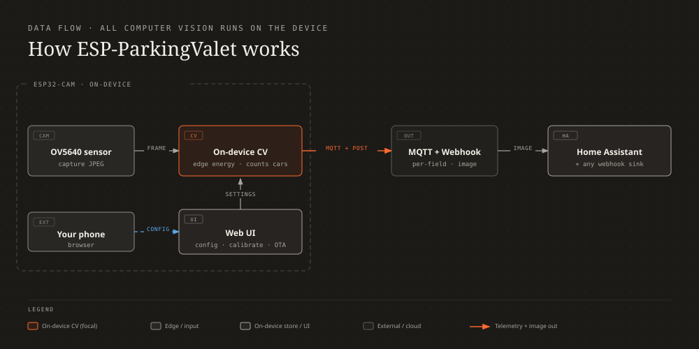
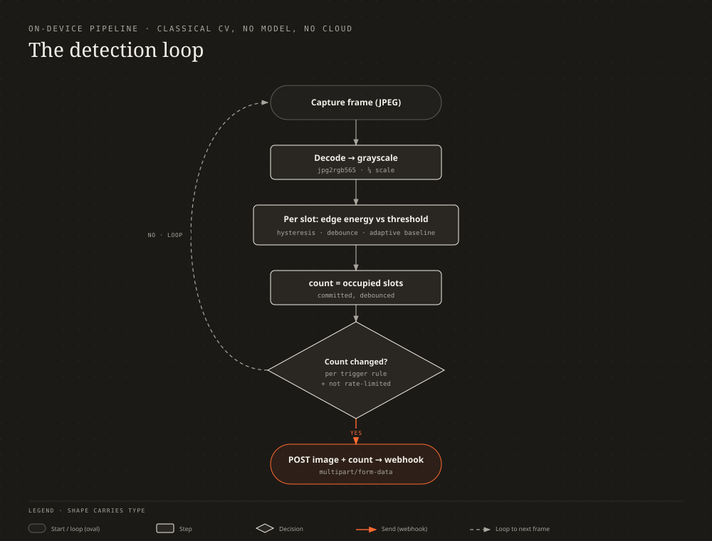
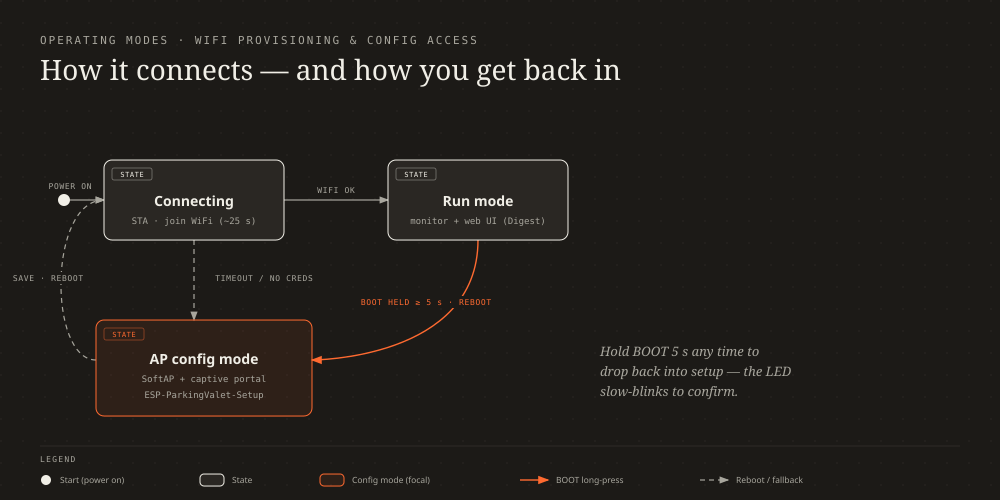

# ESP-ParkingValet

An ESP32-CAM that watches a stretch of on-street curb and estimates how much of it is free. There
are no fixed bays: you trace the curb and the board reports free curb metres, the longest free run,
and an estimated number of free spaces. All of the computer vision runs on the board, so no picture
is ever sent off-device just to measure it. When the estimated number of free spaces changes it
POSTs the photo to a webhook, and it keeps Home Assistant up to date over MQTT.

You configure everything from the web UI, so changing a tunable never means reflashing. On boot
it joins your WiFi; if it can't, it brings up its own setup hotspot. Holding the BOOT button for
five seconds forces that hotspot back whenever you need it.

<p align="center"></p>

> **Hardware:** a plain-ESP32 ESP32-CAM with the OV5640 V1.2 module (ESP32-D0WDQ6, 8 MB PSRAM,
> CH340X USB, IP5306). The pin map is the one from
> [giovi321/ESP32-cam-OV5640](https://github.com/giovi321/ESP32-cam-OV5640), cross-checked against
> the board's own IO table. This firmware replaces ESPHome on the board.
>
> **Repo:** https://github.com/giovi321/ESP-ParkingValet

---

## What it does

- Estimates free curb space on the board with classical CV. You trace the curb into strips that
  the board splits into equal-ground-length cells; each cell's occupancy comes from the edge energy
  inside it, with hysteresis and a debounce so the reading doesn't flicker. Free curb metres, the
  longest free run, and an estimated free-space count come from the run of free cells. There's no
  model and nothing to train.
- POSTs the JPEG to a webhook when the estimated free spaces change (or when it crosses a threshold
  you set). Optional auth header, http or https.
- Keeps changes if the network is down and sends them once it's back, surviving a reboot.
  The queue lives on flash and is bounded; you pick record-only or photo+record.
- Sends a second telemetry webhook on a timer (IP, RSSI, heap, free spaces, version, and so on).
- Publishes to MQTT with Home Assistant auto-discovery: one HA device, each value on its own
  topic, the firmware version and a GitHub link in the device info, and an availability (LWT)
  topic. TLS works too.
- Web UI with a live snapshot, a drag-to-trace curb editor, live per-cell edge values, an
  on-device serial console, and config backup/restore. Every setting is editable at runtime and
  saved to NVS.
- Drives the OV5640 autofocus (focus once, continuous, or off) with a *Focus now* button.
- Looks after itself: auto-reconnect, a WPA2 setup hotspot when it can't join, an offline-reboot
  watchdog, and a status LED.
- OTA updates, factory reset, and a git SHA stamped into every build so you always know what's
  running.

---

## How the estimate works

It grabs a frame about once a second and looks at each cell along the curb you've traced. A parked
car adds a lot of edges and texture next to plain asphalt, and edges hold up far better than
brightness when the sun moves around, so the signal is the edge energy inside each cell. Separate
enter and exit thresholds, a few-frame debounce, and a slowly-adapting "empty" baseline keep the
reading steady through shadows, clouds, and someone wandering across the frame.

<p align="center"></p>

From the run of free cells the board works out the headline numbers ([`src/cv.cpp`](src/cv.cpp)):
free curb in metres (`free_curb_m`), the longest unbroken free run (`longest_free_run_m`), an
estimated number of free spaces (`est_free_spaces`), and whether a car can still fit (`can_fit`).
The webhook and MQTT consumers just receive them.

> **Daylight only.** A bare OV5640 sees almost nothing in the dark; for night you'd add IR light
> and re-tune. The lens is an autofocus module rated for roughly 20-250 cm, so cars further away
> look a bit soft. That's fine for counting, not for reading plates.

---

## First run and WiFi

<p align="center"></p>

On boot it tries your WiFi for about 25 seconds. With no saved network, or if the join fails, it
starts a WPA2 hotspot with a captive portal. You can also force that at any time by holding BOOT
for five seconds; the LED slow-blinks to confirm.

Setting it up the first time:

1. Flash and power the board. It comes up as the hotspot **`ESP-ParkingValet-Setup`**
   (password **`parking1234`**) with the LED slow-blinking.
2. Join it from a phone. The captive portal opens the UI, or browse to `http://192.168.4.1/`.
3. Open **WiFi**, enter your network, and save. It reboots and connects.
4. Once it's on your network (LED heartbeat), find its IP from the serial log or your router and
   open `http://<device-ip>/`.

On your network the UI asks for a login (HTTP Digest, default `admin` / `parking`, and it nags
until you change it in *System*). In setup mode the UI is open, since the hotspot password is
already the gate.

---

## Hardware

### Pin map ([`src/camera_pins.h`](src/camera_pins.h))

| Camera signal | GPIO | | Camera signal | GPIO |
|---|---|---|---|---|
| XCLK (MCLK) | 15 (12 MHz) | | D2 / Y2 | 2 |
| PCLK | 26 | | D3 / Y3 | 14 |
| VSYNC | 18 | | D4 / Y4 | 35 |
| HREF (HS) | 36 | | D5 / Y5 | 12 |
| SIOD / SDA | 22 | | D6 / Y6 | 27 |
| SIOC / SCL | 23 | | D7 / Y7 | 33 |
| RESET | 5 | | D8 / Y8 | 34 |
| PWDN | not wired | | D9 / Y9 | 39 |

### Buttons and LED

| Control | GPIO | Use |
|---|---|---|
| IO0 / BOOT | 0 | Free (the camera doesn't use it). Hold 5 s to drop into AP config mode. |
| RST | EN | Hardware reset. On battery (IP5306), double-click powers down and a single click powers up. |
| Status LED | 25 | Slow blink in AP/config, fast blink while connecting, brief heartbeat once it's running. |

If the LED reads inverted on your board, flip `LED_ACTIVE_LOW` in
[`src/camera_pins.h`](src/camera_pins.h). There's also a `-DPARKINGCAM_BUTTON_DISCOVERY` build
flag that logs GPIO transitions if you ever need to find another button.

### 3D-printed case

A printable enclosure for the board is in
[`hardware/ESPCam_OV5640_case_v5.stl`](hardware/ESPCam_OV5640_case_v5.stl) (modeled in SketchUp).
The geometry is nothing unusual, so slice it with whatever settings your printer already likes.

To put it together you'll need:

- One **1/4" threaded insert**, set about 6 mm into its hole. That's the standard 1/4"-20 camera
  thread, so the finished case screws onto a tripod or any camera mount.
- Four **2 mm × 9 mm self-tapping screws**.
- Four **2 mm × 5 mm self-tapping screws**.

Press or heat-set the insert until it bottoms out in the 6 mm hole, then run the self-tappers
straight into the printed bosses. Ease off on the last turn so you don't strip the plastic.

---

## Build and flash (PlatformIO)

```bash
pio run                 # build (first run downloads the ESP32 toolchain)
pio run -t upload       # flash over USB-C (CH340X)
pio device monitor      # 115200 baud
```

You need a board with PSRAM and at least 4 MB flash (the `min_spiffs` partition keeps two app
slots for OTA). The web UI lives in [`web-src/index.html`](web-src/index.html); a pre-build hook
([`tools/pio_prebuild.py`](tools/pio_prebuild.py)) gzips it into `src/web_ui.h` on every build, and
stamps the git SHA into `src/build_info.h`. To regenerate the UI by hand:

```bash
python tools/gen_web_ui.py
```

Every build records its git short SHA. After flashing, the serial banner
(`ESP-ParkingValet 1.0.0 (<sha>) booting`) and *System > Firmware* (`1.0.0 · <sha>`) show it, so
you can check it against `git rev-parse --short HEAD`.

---

## Tracing the curb

There are no fixed bays. You trace the curb, anchor it with a real length, and the board lays out
equal-ground-length cells and turns the run of free cells into free metres and an estimated
free-space count. This is the part that decides how well it works. Mount the camera so the whole
curb is in frame, then:

1. Open **Live** and, in the **Curb strips** card, tap **Trace** and tap along the curb to place
   points. Tap **Done**. Use **+ Strip** for a second run of curb. Give each strip its real length
   in metres — this is the metric anchor that scales every reading.
2. Set **Target cell length (m)** and tap **Generate cells**. The browser splits each strip into
   equal-ground-length cells (near-curb cells take more image arc per metre to correct for the
   oblique view). Click any cell that isn't real parking curb — a driveway, a crossing, a hydrant —
   to toggle it into a **dead zone** so it never counts. Tap **Save strips & cells**.
3. Watch each cell's live **Edge** value. Empty asphalt reads low, a parked car reads much higher.
4. In **Detection**, pick the occupancy mode and set the threshold (Absolute) or delta (Relative)
   between those two. If the reading twitches, raise **Stable frames** or **Hysteresis**.
5. Set **Car pitch (m)** (vehicle length plus gap) so free metres convert to a sensible free-space
   count. The fastest way is the **street-full calibration**: park the curb bumper-to-bumper, enter
   the car count N, and **Calibrate** — it sets car pitch to strip length ÷ N. **Interior clearance**
   and **End clearance** trim the usable metres between and at the ends of parked cars.
6. Leave it running from sun to cloud and confirm the estimate doesn't jump on moving shadows.

If the reading differs between sunny and overcast — empty curb reading occupied in hard sun, or an
occupied cell reading empty in flat light — use **Relative** occupancy (the default). Each cell
tracks its own auto-learned "empty" edge level (its **Baseline**) and trips only when the edge rises
by the **delta** above it, so the whole scene drifting brighter or darker cancels out.

Two separate things, don't confuse them:

- The **delta** is the *threshold* — how far above empty counts as a car. **You** set this, once,
  globally. Tune it by watching the **Edge** and **Baseline** columns: pick a value a bit below the
  gap a parked car opens over its empty baseline.
- **Baseline** is *what empty looks like*, per cell. It is **automatic** — it self-learns and keeps
  following the light, so it covers the whole sun→cloud continuum on its own. You never type a
  baseline, and marking a cell empty does not change the delta.

Because the Baseline tracks light continuously, you do **not** teach it separate "sunny" and "cloudy"
states — each mark-empty just overwrites the Baseline with the current view. You only seed it directly
when it's wrong: click a cell's chip in the **Cells** card to snap just that cell's Baseline to the
current view, so you can calibrate one empty cell while others stay occupied (a real curb is rarely
all-empty at once). The Detection card's **Mark all cells empty** does every cell for an all-clear
moment. Use it to fix a mis-reading cell, after a boot with a car already parked, or after you move
the camera — not on a schedule.

Baselines are saved to flash and reloaded on boot, so a reboot — the offline-reboot watchdog, an OTA,
a power cycle — no longer throws the learning away and makes occupied cells read empty until they turn
over. (The save is throttled and only happens when a baseline actually moves, so flash wear stays
low.) The one case left is the very first time a cell is seeded with a car already in it, before
anything is stored: mark that cell occupied to fix it on the spot. In relative mode it re-bases the
cell so it reads occupied immediately and then self-heals — once the car leaves, the edge drops below
the new reference and the Baseline relearns true empty.

(Absolute mode stays available and is boot-accurate if you prefer a fixed threshold.)

If you move the camera, re-trace the strips: cell quads are pose-specific and must be redrawn after
the camera angle changes. Use **Camera moved / recalibrate** to re-seed every cell baseline from the
current empty view. Strip geometry is stored normalized (0 to 1), so it survives a resolution change.

---

## Autofocus

The module has a real (VCM) autofocus lens. Pick a mode in **Image > Autofocus**:

- **Off / fixed:** leave the lens alone.
- **Auto once** (default): focus once at boot and lock. Best for a fixed scene.
- **Continuous:** keep refocusing. Only worth it if the scene depth changes, and it can hunt and
  blur a frame mid-count.

**Focus now** triggers a single refocus, and the System tab shows the focus status. The AF
firmware (about 5 KB, from the [0015/ESP32-OV5640-AF](https://github.com/0015/ESP32-OV5640-AF)
library) loads into the sensor over SCCB the first time it's used.

> The lens only physically moves if **AF-VCC** is powered on the module. The firmware load
> succeeds either way, so if the status says *focused* but the picture stays soft, that's the pin
> to check.

---

## Machine-learning occupancy (optional)

The occupancy decision can run a small model trained on this camera's own data instead of the
edge-energy threshold — more robust to weather/lighting. See
[docs/training-the-classifier.md](docs/training-the-classifier.md).

---

## Configuration reference

Everything here is editable in the UI and saved to NVS. Defaults come from
[`src/config_store.cpp`](src/config_store.cpp).

| Group | Setting | Default | Notes |
|---|---|---|---|
| WiFi | `staSsid` / `staPass` | — | Your network. Saving reboots to reconnect. |
| | `apSsid` / `apPass` | `ESP-ParkingValet-Setup` / `parking1234` | Setup hotspot (WPA2, password at least 8 chars). |
| | `hostname` | `esp-parkingvalet` | mDNS/DHCP hostname. |
| | `apRetryMin` | `0` | While in AP fallback (a join failed), re-attempt the saved WiFi every this many minutes; switches back to STA once it reconnects, otherwise stays in AP and keeps looping. The setup hotspot is briefly unreachable during each attempt. For this soft retry to run before a hard reboot, set it shorter than `offlineRebootMin`. 0 is off. |
| | `offlineRebootMin` | `0` | Reboot if WiFi stays down this many minutes (0 is off). Keeps retrying until back online. |
| | `wgEnabled` | `false` | Join a WireGuard VPN so the device is reachable remotely (web UI/OTA on the tunnel IP). |
| | `wgPrivateKey` / `wgPresharedKey` | — | Device WireGuard keys (secret; masked over the API). Preshared key is optional. |
| | `wgAddress` | — | Device tunnel IP, e.g. `10.6.0.7` (a `/32` suffix is accepted). |
| | `wgPeerPublicKey` / `wgEndpointHost` / `wgEndpointPort` | — / — / `51820` | The homelab WireGuard server's public key and host:port. |
| | `wgAllowedIps` | — | Subnet routed through the tunnel, e.g. `10.6.0.0/24`. |
| | `wgKeepalive` | `25` | Persistent-keepalive seconds (holds the NAT mapping open; 0 = off). |
| Web auth | `adminUser` / `adminPass` | `admin` / `parking` | Digest auth in STA mode. Change it on first login. |
| Webhook | `whEnabled` | `false` | Master on/off for sending. |
| | `whUrl` | — | Full URL (http or https). |
| | `whAuthHeaderName` / `whAuthHeaderValue` | — | e.g. `X-API-Key` or `Authorization: Bearer …`. |
| | `whTlsInsecure` | `true` | Skip cert check for self-signed https. |
| Offline spool | `spoolMode` | `1` (count only) | Queue count changes when offline: 0 off, 1 count-only, 2 photo+count. |
| | `spoolMaxEntries` | `20` | Drop the oldest once the queue passes this many. |
| | `spoolMaxKB` | `96` | Drop the oldest once it passes this size. Also capped by free flash. |
| | `spoolBackend` | `0` (auto) | 0 auto (SD if present, else flash), 1 flash. SD is unusable on this board, so it's always flash. |
| Stats webhook | `statsEnabled` | `false` | Periodic telemetry on/off. |
| | `statsUrl` | — | Full URL (separate from the image webhook). |
| | `statsIntervalS` | `300` | Seconds between telemetry POSTs. |
| | `statsAuthHeaderName` / `statsAuthHeaderValue` | — | Optional auth header. |
| | `statsTlsInsecure` | `true` | Skip cert check for self-signed https. |
| MQTT | `mqttEnabled` | `false` | Master on/off. |
| | `mqttHost` / `mqttPort` | — / `1883` | Broker host and port (8883 for TLS). |
| | `mqttTls` / `mqttTlsInsecure` | `false` / `true` | mqtts, and skip cert check. |
| | `mqttUser` / `mqttPass` | — | Broker credentials (optional). |
| | `mqttBaseTopic` | `parking-valet` | Per-field topics live under here. |
| | `mqttDiscovery` / `mqttDiscoveryPrefix` | `true` / `homeassistant` | HA auto-discovery. |
| | `mqttIntervalS` | `60` | Diagnostics refresh interval (the free-space estimate goes out immediately). |
| Trigger | `triggerMode` | `0` | 0 sends on any change in estimated free spaces, 1 sends when it crosses threshold N. |
| | `triggerThreshold` | `1` | N, for threshold mode. |
| | `minSendIntervalMs` | `5000` | Min gap between *new* free-space-change sends (rate-limit at the source). A queued backlog drains faster than this — capped at 1 s/entry — so a reconnect doesn't leave the latest estimate stuck behind stale ones. |
| | `heartbeatIntervalS` | `0` | 0 is off, otherwise a periodic snapshot. |
| Detection | `occupancyMode` | `1` | `0` absolute edge threshold, `1` relative to each cell's adaptive empty baseline (cancels sun/shade drift). Default is relative. |
| | `edgeThreshold` | `12.0` | Absolute mode: global occupancy threshold (mean abs gradient). |
| | `relDelta` | `6.0` | Relative mode: edge rise above the empty baseline that counts as occupied. |
| | `hysteresis` | `0.25` | Enter at thr·(1+h), exit at thr·(1−h). |
| | `baselineEma` | `0.02` | How fast the empty baseline adapts (the live reference in relative mode). |
| | `stableFrames` | `4` | Cycles a cell's state must hold before it commits. |
| | `captureIntervalMs` | `1500` | Capture/analyze cadence. |
| Curb | `carPitchM` | `6.0` | Assumed length of one parked car plus gap; converts free metres to an estimated free-space count. |
| | `clearInteriorM` | `1.2` | Clearance trimmed between parked cars when estimating free spaces. |
| | `clearEndM` | `1.8` | Clearance trimmed at each end of a free run. |
| | `smoothMode` | `1` | Temporal smoothing of the per-cell reading. |
| | `darkLumaThresh` | `40.0` | Mean luma below this raises the `dark` flag. |
| | `pitchLearn` | `1` | Auto-learn car pitch from detections (street-full calibration turns it off). |
| Image | `framesize` | `9` (SVGA 800×600) | QVGA up to UXGA; bigger is sharper but slower. |
| | `jpegQuality` | `12` | 8 (best) to 63 (smallest). Below 8 the OV5640 can produce bad frames, so it's clamped to 8. |
| | `vFlip` / `hMirror` | `false` | Orientation. |
| | `brightness` / `contrast` / `saturation` | `0` | −2 to 2. |
| | `awb` / `aec` | `true` | Auto white-balance / auto-exposure. |
| | `afMode` | `1` | Autofocus: 0 off/fixed, 1 focus once, 2 continuous. |
| Curb geometry | `strips` | — | Traced curb strips (name, real length in metres, cell count). Set by tracing in the web UI, not typed by hand. |
| | `cells` | — | Equal-ground-length cells generated from the strips (normalized 0 to 1). Toggle a cell off to make it a dead zone. |

### Remote access (WireGuard)

The device can join your homelab WireGuard network as an outbound client so the web UI and
OTA are reachable from anywhere on that VPN — no port-forwarding, nothing exposed publicly.

1. Generate a keypair for the device (`wg genkey | tee privatekey | wg pubkey`).
2. On your WireGuard **server**, add the device as a peer: its public key, and **its tunnel
   IP in that peer's `AllowedIPs`** (e.g. `10.6.0.7/32`). Without this the tunnel connects but
   return traffic never reaches the device, so the UI stays unreachable.
3. In the device UI (WireGuard card): set Private key, Address (the device tunnel IP), Peer
   public key, Endpoint host/port (the server), Allowed IPs (the homelab subnet, e.g.
   `10.6.0.0/24`), and Keepalive 25. Tick Enable and Save.
4. The tunnel comes up only after the device's clock is NTP-synced. Then reach the device at
   its tunnel IP.

**Security note:** the WireGuard private key is stored in NVS in plaintext unless flash
encryption is enabled — recoverable by anyone with physical access to the flash chip. Give
the device a narrowly-scoped peer (limit what its key can reach on the server side), and
enable flash encryption if at-rest protection matters.

---

## Webhook payload

`multipart/form-data`, built in PSRAM, sent with `HTTPClient` (`WiFiClientSecure` for https):

| Part | Type | Description |
|---|---|---|
| `image` | file (JPEG) | Filename `<hostname>_<uptimeS>.jpg`. Absent on a count-only replay. |
| `device` | field | Hostname. |
| `event` | field | `count_changed`, `heartbeat`, or `test`. |
| `free_curb_m` | field | Estimated free curb in metres (2 decimals). |
| `est_free_spaces` / `prev_est_free_spaces` | field | New and previous estimated free-space count (an estimate; the change is the trigger). |
| `can_fit` | field | `true`/`false` — whether a car still fits. |
| `reliable_range_m` | field | How far down the curb the estimate is trustworthy, metres (2 decimals). |
| `occupied_fraction` | field | Fraction of the tracked curb reading occupied (3 decimals). |
| `ts` / `time` | field | UTC timestamp: epoch seconds and ISO8601. Both empty until NTP syncs. |
| `queued` / `queued_age_s` | field | `queued` is `true` on a replayed event and `false` on a live one; `queued_age_s` (present only when queued) is how long it waited. |

The image webhook deliberately carries no diagnostics, just the photo, the free-space metrics, and
the timestamp. Diagnostics go to MQTT and the stats webhook. Your auth header, if set, goes on every
request, and the clock is NTP-synced in UTC. Any HTTP endpoint can take it; the JPEG arrives as a
multipart file field named `image`. If the offline queue is on, changes that happened during an
outage get replayed here once the link is back (see [When the link drops](#when-the-link-drops)),
and a count-only replay arrives with no `image` part, so the receiver has to handle a missing photo.

### Stats webhook

A separate `application/json` POST every `statsIntervalS` to `statsUrl`. Fields: `device`,
`version`, `build`, `mode`, `ip`, `rssi`, `ssid`, `mac`, `uptime_s`, `heap_free`, `psram_free`,
`reset_reason`, `strip_count`, `cell_count`, `est_free_spaces`, `free_curb_m`, `can_fit`,
`reliable_range_m`, `occupied_fraction`, `cv_ms`, `analysis` (e.g. `200x150`), `webhook_enabled`,
`ts` (UTC epoch), `time` (ISO8601). The **Send stats now** button posts it on demand.

---

## When the link drops

A change used to vanish if the network was down at the wrong moment. The board POSTed once, and if
nothing answered, the change was gone. Worse, it moved on as though it had sent, so it never tried
again.

Now there's a queue. While the link is up and the queue is empty, a change is sent live with its
freshly-captured photo. Only when the device is offline, still draining a backlog, or the live POST
fails does the change get written to flash instead, to be delivered when the link comes back — so a
live update keeps its photo, while a backfilled one is count-only. The queue survives a WiFi blip and
a full reboot, including the offline-reboot watchdog firing in the middle of an outage. When the
queue fills up, the oldest entry drops off.

When the link returns, the backlog drains quickly — up to one entry per second, not one per
`minSendIntervalMs` — so the most recent estimate reaches the channel within seconds instead of
trailing the whole backlog. (`minSendIntervalMs` still rate-limits how often *new* changes are
queued; it no longer throttles replay.) If the receiver is down, delivery backs off to the full
interval rather than hammering it.

You choose what gets saved in the **Offline spool** card:

- **Count only** (the default): just the record (the free-space metrics — free curb metres,
  estimated free spaces and previous, can-fit, reliable range, occupied fraction — and when it
  happened). Tiny, so the queue runs deep.
- **Photo + count:** the JPEG as well. Much heavier; see the capacity note below.
- **Off:** the old behavior, send once and move on.

A replayed event keeps its original timestamp and adds two fields, `queued` (true) and
`queued_age_s`, so the receiver can tell a backfill apart from something that just happened. A
count-only replay has no `image` part, so whatever consumes the webhook needs to cope with a
missing photo.

About capacity: this board can't use an SD card. The camera already sits on the pins SD would need
(GPIO 2, 12, 14, and 15 are the SD_MMC bus), so the queue lives on the internal flash `spiffs`
partition instead. That's about 128 KB, and LittleFS hands it out in 4 KB blocks, so in practice
you get room for roughly 20 count records, or one or two photos. The backend setting still offers
"auto (SD if present, else flash)" for some future board with spare pins; here it always resolves
to flash, and the UI tells you so. Count-only is the sensible default. Heartbeats aren't queued, so
a long outage won't bury the real changes under them.

Queue depth and size show live in the card, and **Clear queue** empties it.

---

## MQTT and Home Assistant

Set the broker up in the **MQTT** tab: host, port, optional TLS (mqtts), username/password, base
topic, discovery, and interval. Once it's on, the board:

- Publishes each field to its own retained topic under the base topic, like
  `parking-valet/free_curb_m`, `/longest_free_run_m`, `/est_free_spaces`, `/reliable_range_m`,
  `/occupied_fraction`, `/cell_count`, plus diagnostics `/rssi`, `/ip`, `/ssid`, `/uptime_s`,
  `/heap_free`, `/psram_free`, `/mode`, `/version`, `/build`, `/time`. Two binary topics carry
  `ON`/`OFF`: `/can_fit` (room for a car) and `/dark` (low light). The estimate goes out the moment
  it changes; the rest refresh on the interval.
- With auto-discovery on, publishes retained configs under
  `homeassistant/sensor/parkingvalet/<key>/config` (and `binary_sensor/…/config` for `can_fit` and
  `dark`). Home Assistant then builds one device (*ESP-ParkingValet*) that carries the firmware
  version (`sw_version`) and a GitHub link (`configuration_url`). Device classes and units are
  filled in (signal_strength, duration, data_size, timestamp, and so on), and the diagnostics are
  tagged as such. It also discovers the camera snapshot (`/photo`) and two control buttons that
  publish to `/cmd/photo` and `/cmd/mark_all_free`.
- Sets an availability (LWT) topic, `parking-valet/availability` (`online`/`offline`), so HA marks
  the device unavailable if it drops off the network.

The old `parking-valet/count` and `/roi_count` topics and the per-bay `bayN` sensors and selects
are gone; on connect the firmware publishes them once as empty retained messages to purge the
legacy entities from HA.

It carries the same information as the two webhooks. The photo itself stays on the image webhook,
though a snapshot can also be pushed to `parking-valet/photo` on demand. **Publish now** in the MQTT
tab pushes immediately, and the System tab shows the connection state.

---

## Backup and restore

In **System > Backup & restore**, *Download backup* saves the whole config as JSON (it includes
secrets, so keep the file somewhere safe) and *Restore* uploads one and reboots to apply it. The
same thing is available at `GET /api/backup` and `POST /api/restore`.

---

## HTTP API

In STA mode every route needs Digest auth. In AP/setup mode they're open.

| Method | Path | Purpose |
|---|---|---|
| `GET` | `/` | The web UI (gzipped). |
| `GET` | `/api/state` | Live status: mode, IP, RSSI, free-space estimate and curb metrics, per-cell values, heap, AF and MQTT status, last send. |
| `GET` | `/api/config` | Current config (secrets masked). |
| `POST` | `/api/config` | Merge a partial config (blank secrets are left alone). |
| `GET` | `/snapshot` | Current camera JPEG. |
| `GET` | `/api/log` | The on-device log ring buffer (this is what the web serial console reads). |
| `GET` | `/api/backup` | Download the full config as JSON (includes secrets). |
| `POST` | `/api/restore` | Restore a backup, then reboot. |
| `POST` | `/api/action` | `{"action":"reboot\|factory_reset\|ap_mode\|test_webhook\|test_stats\|test_mqtt\|af_focus\|clear_spool\|recalibrate\|mark_occupied"}`. `recalibrate` = "mark empty now" (add `"slot":N` for one cell, omit for all); `mark_occupied` = force one cell occupied, requires `"slot":N`. |
| `POST` | `/update` | OTA firmware upload (`.bin`). |

---

## Security

The STA web UI uses HTTP Digest auth, so the password never crosses the wire in clear and there's
no need for TLS on a trusted LAN. Put a reverse proxy in front if you want transport encryption.
Setup mode is gated by the WPA2 hotspot password. Webhook and MQTT egress can both use TLS and
carry your credentials. Config (including secrets) lives in NVS on internal flash; turn on flash
encryption if at-rest protection matters. The config API (`GET /api/config`) masks secrets; only the
explicit backup download (`GET /api/backup`) returns them, and every route is behind Digest auth in
STA mode.

---

## Troubleshooting

| Symptom | Check |
|---|---|
| `camera init failed` on boot | Confirm it's the OV5640 V1.2 board, the ribbon is seated, and PSRAM is present. Pin map is in `camera_pins.h`. |
| Free-space estimate jumps on shadows/clouds | Raise the threshold (`edgeThreshold`) or delta (`relDelta`), `hysteresis`, or `stableFrames`, and keep moving shade off the traced curb. |
| A car reads as empty | Lower the threshold/delta, or re-trace so the cell covers bumper and wheels (more edges). |
| Can't reach the UI | Confirm the IP (serial or router); in STA mode you have to log in. Hold BOOT 5 s to force AP mode. |
| Webhook never arrives | Enable it; check the URL is reachable from the camera's subnet; check the auth header; tick *Skip TLS check* for self-signed https. `HTTP -1000` in the UI means it's disabled or has no URL, and *Send test* works even when disabled. |
| LED behaves backwards | Flip `LED_ACTIVE_LOW` in `camera_pins.h`. |
| Autofocus does nothing | Set Image > Autofocus to *Auto once* and hit *Focus now*; the serial console should log `OV5640 AF firmware init: ok`. If status says *focused* but it stays soft, AF-VCC isn't powered. |
| Want logs without a cable | Use the serial console in the System tab, or `pio device monitor`. |
| MQTT won't connect | Check host/port, TLS, and credentials; the System tab shows *connecting…* vs *connected* and the console logs the connect code. For HA entities, make sure discovery is on and the prefix matches (`homeassistant`). |

---

## Repository layout

```
platformio.ini            build config, pre-build hooks (UI gzip + git-SHA stamp), libs (AF, MQTT)
docs/*.svg                diagrams (data flow, CV pipeline, operating modes)
hardware/*.stl            3D-printable enclosure
web-src/index.html        the web UI (edit here)
tools/gen_web_ui.py       gzip the UI into src/web_ui.h
tools/pio_prebuild.py     pre-build hook: regenerates web_ui.h and build_info.h
src/
  main.cpp                setup, the capture/analyze/send loop, status LED, stats sender
  camera_pins.h           OV5640 pin map, BOOT button, status LED
  camera.{h,cpp}          camera init, live sensor settings, OV5640 autofocus
  config_store.{h,cpp}    NVS config model, defaults, JSON, backup/restore
  cv.{h,cpp}              on-device per-cell curb occupancy + free-space estimate CV
  cv_state.{h,cpp}        persist per-cell baselines to NVS so they survive reboots
  clk.{h,cpp}             NTP / UTC clock
  net.{h,cpp}             WiFi STA/AP state machine, webhook POST (multipart and JSON)
  spool.{h,cpp}           offline store-and-forward queue (LittleFS) for free-space changes
  mqttc.{h,cpp}           native MQTT client + Home Assistant auto-discovery
  buttons.{h,cpp}         BOOT long-press to AP mode + discovery helper
  logbuf.{h,cpp}          log capture for the web serial console
  web_server.{h,cpp}      the web server: UI, config/state API, snapshot, log, backup, OTA, portal
  web_ui.h                generated from web-src/ on build
  build_info.h            generated git-SHA stamp (gitignored)
```

---

## License

WTFPL. Do what you want.
